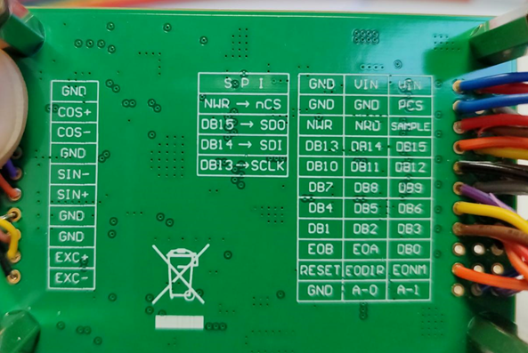

# resolver-ad2s1210-F28379D
resolver ad2s1210 code for Texas Instruments TMS F28379D
These code interface the F28379D to an AD2S1210 board using SPI (Serial Peripheral Interface)

For 8-bit data, you need to shift left (LSL) by 8 bits before sending it to SPITXBUF = data << 8;
While reading from SPIRXBUF is aligned to the least significant bit (LSB)
timing
SCLK 1 us donc fclk= 1 MHz, donc 
t16=2*1us+20ns = 2.02 us
t17=6*1us+20ns = 6.02 us

Even if it is 10 kHz, I noticed that we must configure it (see '''void ad2s1210_conf(void)''')
#define  SDI_GPIO       58
#define  SDO_GPIO       59
#define  CLK_GPIO       60
#define  CLK_MUX        15
#define  SCS_GPIO        61 // /WR c'est le /CS de la SPI
#define  AD2S1210_WR     SCS_GPIO
#define  AD2S1210_SAMPLE 18

Faults than can occur

For example if the USB power is not enough, I started having:
ad2s1210_fault
0x08 LOT
0x68 LOT LOS DOS
0x60 LOS DOS
0x00 No error

special thanks to https://github.com/arcoslab/omni-base/tree/master/baldor_control
for their code for STM
