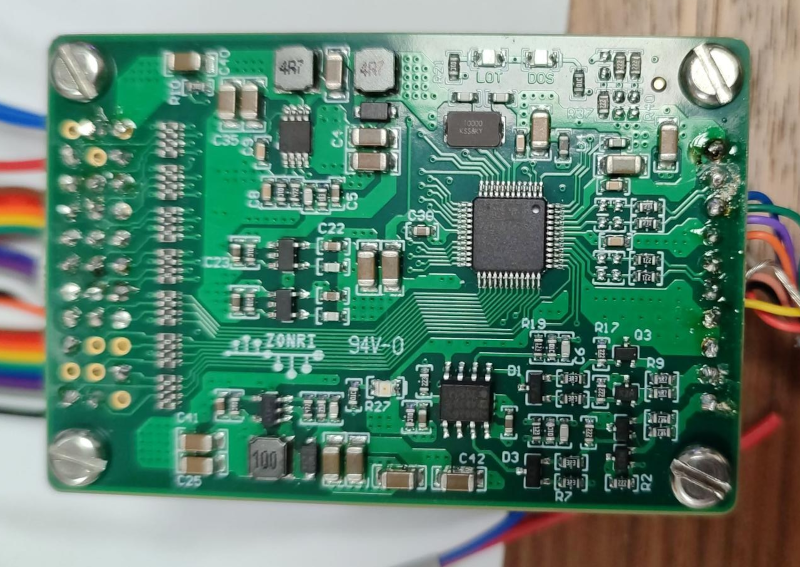

# resolver-ad2s1210-F28379D
resolver ad2s1210 code for Texas Instruments TMS F28379D

This code interface the F28379D to an AD2S1210 board using SPI (Serial Peripheral Interface)


The AD2S1210 creates an excitation signal to be sent to the resolver and decodes the sin/cos signals to an absolute position
and also gives the rotational speed

You can buy the board that interface the AD2S1210 on 
https://www.aliexpress.com/item/4000089694042.html




**Here are some tips of connection and configuration**

PCS is not a positive Chip Select, it is an /CS so leave it NC or to GND

You need to set A0, A1, RESET at 3.3V

A0 and A1 logical high means that the device is in configuration mode, we can configure it (excitation frequency, resolution)
but also read the data

**Control Register**


To set the resolution, we need to send on SPI :
```
SpiaRegs.SPITXBUF = AD2S1210_REG_CNTRL<<8;
SpiaRegs.SPITXBUF = 0x7F<<8; // 16 bits and 0x7E for 12 bit
```
**Important** For 8-bit data, you need to shift left (LSL) by 8 bits before sending it to SPITXBUF = data << 8;

The complete code, with the correct SPI /CS and timing:
```
 // Setting resolution to 16bits
    GPIO_WritePin(SCS_GPIO, 0);
    SpiaRegs.SPITXBUF = AD2S1210_REG_CNTRL<<8;
    while(SpiaRegs.SPISTS.bit.INT_FLAG == 0);
    dummy = SpiaRegs.SPIRXBUF;
    GPIO_WritePin(SCS_GPIO, 1);
    //DELAY_US(0.01); //10ns
    GPIO_WritePin(SCS_GPIO, 0);
    SpiaRegs.SPITXBUF = 0x7F<<8; // 16 bits and 0x7E for 12 bit
    while(SpiaRegs.SPISTS.bit.INT_FLAG == 0);
    dummy = SpiaRegs.SPIRXBUF;
    GPIO_WritePin(SCS_GPIO, 1); 
```

**Setting the excitation frequency**


Even if it is 10 kHz, I noticed that we must configure it, see `void ad2s1210_conf(void);`
```
    GPIO_WritePin(SCS_GPIO, 0);
    SpiaRegs.SPITXBUF = AD2S1210_REG_EXC_FREQ<<8;
    while(SpiaRegs.SPISTS.bit.INT_FLAG == 0);
    dummy = SpiaRegs.SPIRXBUF;
    GPIO_WritePin(SCS_GPIO, 1);
    DELAY_US(0.01);
    GPIO_WritePin(SCS_GPIO, 0);
//    SpiaRegs.SPITXBUF = 0x12<<8;    // 4.5KHz
    SpiaRegs.SPITXBUF = 0x28<<8;    // 10KHz
    while(SpiaRegs.SPISTS.bit.INT_FLAG == 0);
    dummy = SpiaRegs.SPIRXBUF;
    GPIO_WritePin(SCS_GPIO, 1);
    DELAY_US(0.01);
```

**Sampling the data**

**Sample** line must be put Low than High in order to do the conversion

this is an example of reading the position, velocity and error (fault) by using  A0 an A1 after a Sample request


I don't do that in my program, I am always in Configuration mode (A0 and A1 high)

I sample, then I read the data


Here is how to Sample
```
void AD2S1210_SAMPLING() {
    GPIO_WritePin(AD2S1210_SAMPLE, 1);
    GPIO_WritePin(AD2S1210_SAMPLE, 0);
    DELAY_US(2);            // t16 = 2 × tCK + 20 ns min = 2 us pour tclk=1us
    GPIO_WritePin(AD2S1210_SAMPLE, 1);
    DELAY_US(4);            // t17-t16 = (6-2) × tCK ns min
    // can be avoided if the read is performed long after
    // now we can read
}
 ```

timing:

2 CLK periods then 4 CLK periods

As I am not sure about the fclk, which should be less than 6.144 MHz (Datasheet) but on the board there is a 10 MHz quartz...
I used my SPI CLK (1 MHz) as a reference for my ticks.
I think we can go much faster of course, if your wires are short.
```
SCLK 1 us (fclk= 1 MHz)
t16=2*1us+20ns = 2.02 us
t17=6*1us+20ns = 6.02 us
```

Then we can read the position and/or the velocity and the error registers.


**Important** For 8-bit data, you need to shift left (LSL) by 8 bits before sending it to SPITXBUF = data << 8;

This is due to F28379D SPI which is a 16 bits one than can be confugured in 8 bits

While reading from SPIRXBUF is aligned to the least significant bit (LSB)


**Configuration of SPI on F28379d**

I use the TI F28379d Launchpad with the following GPIO configuration

SDI means Serial Data Input so it is a MOSI: Master (DSC) Output Slave Input

The AD2S1210 /WR line is the SPI /CS line. Do not confuse with AD2S1210 /CS that mus always held low


```#define  SDI_GPIO       58
#define  SDO_GPIO       59
#define  CLK_GPIO       60
#define  CLK_MUX        15
#define  SCS_GPIO        61 // /WR c'est le /CS de la SPI
#define  AD2S1210_WR     SCS_GPIO
#define  AD2S1210_SAMPLE 18
```


**Faults than can occur**


For example if the USB power is not enough, I started having:
```ad2s1210_fault
0x08 LOT
0x68 LOT LOS DOS
0x60 LOS DOS
0x00 No error
```


There are 2 red leds that powers when LOT and DOS faults appear

special thanks to https://github.com/arcoslab/omni-base/tree/master/baldor_control
for their code for STM which inspires me
